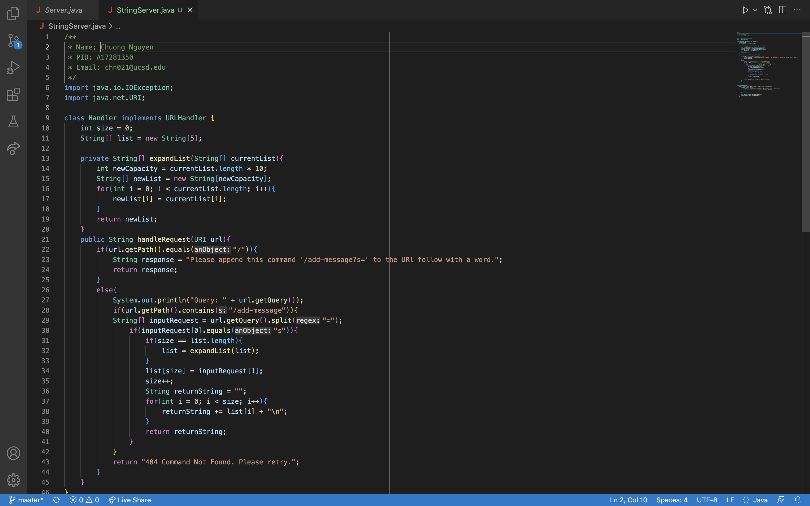
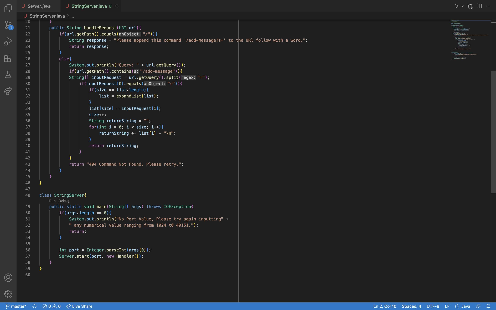
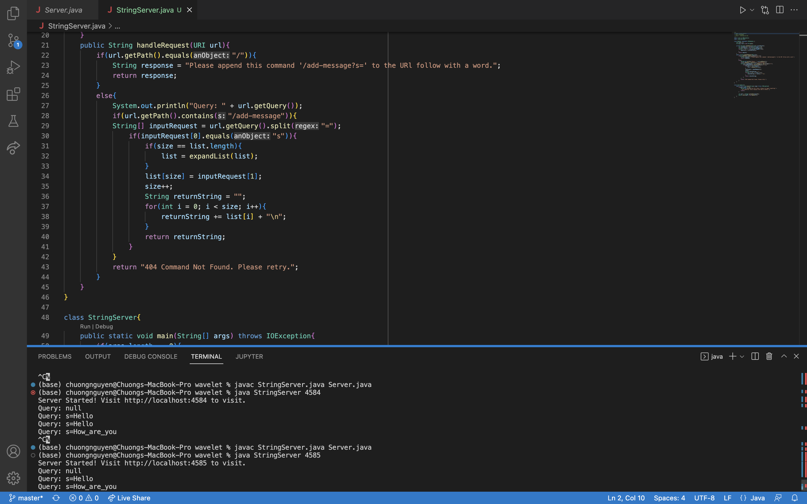
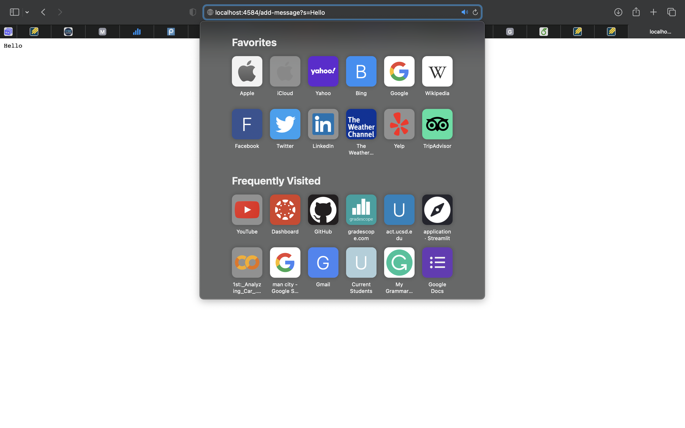

# Lab Report 2

- Name: Chuong Nguyen
- Email: chn021@ucsd.edu
---

## Part 1

- Below are some of the images displaying codes that show how a web server is made.

- In this '**StringServer.java**' file, I have two classes, a handler class and a StringServer class. The handler class is supposed to handle all requests made by the users. While, the StringServer class will be responsible for starting the server.

1. Class Handler implements an interface URLHandler:
    - The class has two field variables and two methods, one is a private helper method and the other is a public method.

    1. Field Variables:
        - Variable size is an integer type that takes note of the number of elements in the array. The variable will be incremented after each time a new element is added.
        - Variable list is an array type that holds the cumulative input strings from user requests.
    2. Methods:
        - The expandList method is a helper method which takes in an array of String type referencing to a list object containing all current input elements. This method is supposed to expand the length of list array by ten more indices when the number of element (size) is equal to the current array length.
        - The handleRequest is a public method that returns an output corresponding to the user request. If the url's path is equal to '/' then return a statement informing user the avaible requests that the users could make. If the request is equal to the 'add-message', the computer will find the query and make a comparison. Before comparing the query, the query will be splitted into two elements, each storing data on each side of the equal sign. If the right side of the query is equal to 's', the left side will be appened to the list array. After each call, the all string elements in the list array will be concatenated to a single string and display the output to the user on the webpage.
2. Class StringServer:
    - The class has one public method that will start the web server.

    1. Method:
        - The main method will look for an input value which is equivalent to port number in order to start the server, while the input is valid in the range from 1024 to 49151. When the input value taken from the terminal is the valid, the value will be converted from String to an Integer which will be used as the port number. Afterward, the server will starter by creating a new handler object.

- Note: This algorithm could be shortened by just concatenating all inputs to a single string instead of having to store in an array and iterate through the array using the for loop to access and append elements to a single array. Despite the shorter route, I encountered a problem using just the string instead of the array. The problem was that everytime when I make a new request to add a new word, both the last previous term and newly requested term will both be concatenated despite the previous word has already been added. Meaning that each term will be unintentionally added twice to the list. I later found out that the problem was caused by me using the device memory to paste the previous url link and replace the old term with the new term in query. Though the problem was found, I decided to continue with my current approach because I think it is beneficial for me to practice with arrays, lists, and data structures expecially while taking CSE 12.

---

- In the terminal, I compiled both the StringSever.java and Server.java files. After word, I ran the java StringSever file with the port number equals to 4585. Once entered, a local url link will be displayed for the user to view. In the terminal, I have the query printed out after each request made to make sure the server works correctly and to make it easier for debugging.

---

1. Which methods will be called?
    - The main method in class StringServer will always be called in order for the web server to be up and running. When the web server first runs, the handleRequest method will be called to handle '/' request which will return a statement telling users the next option to choose.
    - In the example above, method handleRequest will be called to handle request of path equals to 'add-message' and query equals to '?s=String' which in this case is 'Hello'. 
    - Since 'Hello' is the first element in the list array with length up to 5, expandList will not be called.

2. What are the relevant arguments to those methos, and the values of any relevant fields of the class? 
    1. Relevant Arguments:
        - For the handleRequest method in the Handler class, the argument contains one URI object. This URI object will be used to determine the request made by the users.
        - For the expandList method in the Handler class, the argument contains a string array which holds the same reference to the list array object. The array will be used to detemine the new length of the array after expansionl, and also to transfer all elements from the old array to the new array. Since the array has fixed length, expansion could only be possible by creating a bigger array and transfer all current elements to the neww array.
        - For the main method in the StringServer class, the argument contains a string array that takes in all user inputs from the terminal. In this case, the value will be taken in and read as the port value for the server, while the value is valid.
    2. Relevant Fields:
        - There are only two field variables in this file, and both happend to be in the handler class. The size variable which is initialized to zero will keep track of the number of elements in the Array. While the list of string array is initially set to an object with length 5 to store elements from user requests for display on the server after each valid request.
3. How are the values of any relevant fields of the class change from this specific request? If no values got changed, explain why.
    - The values of any relevant fields will be perceived as string type when passing as requests. So no matter what type of fields the values are, the values will always be added to the list and printed out as string type. Each time a new string is added, the size of list will be incremented by one.
